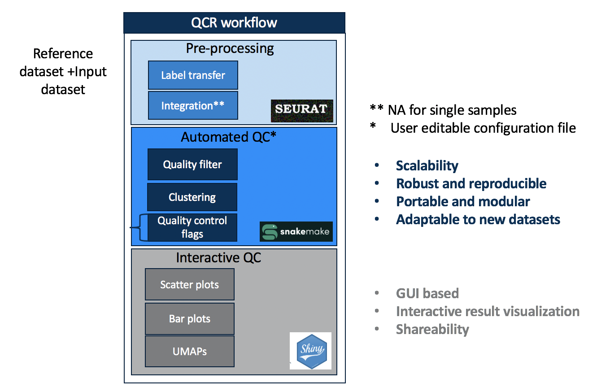

# QCR

## Quality Control for scRNA-seq data

QCR is a workflow for adding several Quality Control (QC) flags to scRNA-seq cells or nuclei which can be used for downstream processing. It consists of three parts, pre-processing, automated workflow and interactive workflow.



## Pre-processing:

Performs normalization of seurat object/query object and transfers subclass label from a reference object to seurat object cells. This is a required step as some flags are based on the cell label transfer.


```
cd seurat/

Usage: Rscript <normalize_and_label_transfer_script> <work-dir location> <seurat-object in RDS/Rdata location> <reference-obj in RDS/Rdatalocation>

Example: Rscript ./seurat/scripts/normalize_and_label_transfer_objects.R /allen/programs/celltypes/workgroups/hct/SEA-AD/RNAseq/QCR/seurat/ ./seurat/data/H2033038.RData /allen/programs/celltypes/workgroups/rnaseqanalysis/sarojaS/210426_QCR/data/reference_subset.RDS
```

## Automated workflow:

Snakemake workflow which take the normalized and label transferred seurat object as input and adds several automated QC flags to the metadata of the Seurat object at cell and metacell (group of cells using Louvain clustering in Seurat) level.

### Config file:
```
cd ../snakemake/config_script/  

Usage: sh <config_file_maker.sh> <path to normalized and labelled seurat data (*.RDS)> >  ../config.yaml

Example: sh ./snakemake/config_script/config_yaml.sh /allen/programs/celltypes/workgroups/hct/SEA-AD/RNAseq/QCR/seurat/data/ > ../config.yaml
```
### Snakemake run:

```
1. cd ../
2. Fill in config file values 
Note: example config file with default values for all keys except samples, workdir and reference can be found under ./snakemake/config_script/config_default.yaml
3. snakemake -np --use-conda --cores 30 (dry run)
4. snakemake -p  --use-conda --cores 30 (actual run)
```

## Interactive workflow:

Shiny app for visualizing the UMAPs and scatter plots from Snakemake workflow, and also add user defined flags to cells in the Seurat object by brushing

```
COMING SOON ...
```

## R WRAPPER:

A follow up function to Seurat functions to add QC flags to scRNA cells when analyzing data with Seurat

```
COMING SOON ...
```
## License
The license for this package is available on Github at: https://github.com/AllenInstitute/QCR_HVS/blob/master/LICENSE

## Level of Support
We are planning on occasional updating this repo with no fixed schedule, but likely several times per year. Community involvement is encouraged through both issues and pull requests.


